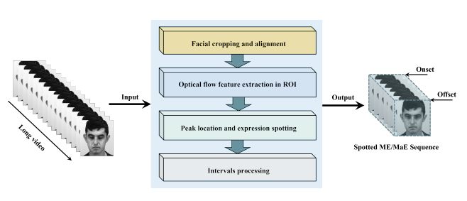
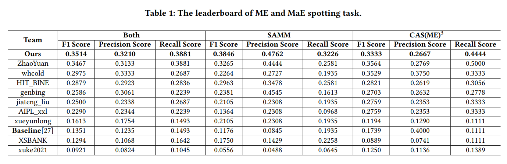

# Facial Expression Spotting Based on Optical Flow Features

<!-- 

 -->

This repository is an implementation of the paper [Facial Expression Spotting Based on Optical Flow Features](https://dl.acm.org/doi/abs/10.1145/3503161.3551608), published in ACM MM2022. 

Our pipeline can be devided into 4 parts:

Facial cropping and alignment

Optical flow fezture extraction in RoI

Peak location and expression spotting
 
Intervals processing

For face detection and cropping, We can use the pretrained retinaface model to detect all the faces and crop them by the bboxes, the RetinaFace is implemented by MindSpore. 

ME and MaE spotting task is often inseparable from the extraction of optical flow features. However, a persistent challenge of
such methods is that the optical flow features of the whole face
contain both facial expression motion information and many facial
motion information unrelated to expression. We effectively remove
expression-irrelevant information from the optical flow features by
face cropping and alignment, optical flow extraction from the RoI
regions, denoising, and sliding window method, thus making the
ME and MaE spotting method based on optical flow features more
accurate.
We conduct experiments on the the unseen testing set (MEGC2022-
TestSet). For CAS(ME)3 dataset, the 𝐹1 score of the proposed method
is 0.3333. For SAMM dataset, the 𝐹1 score is 0.3846. The overall 𝐹1
score is 0.3514 and we achieve the first place in the MEGC2022
Challenge. The results prove the effectiveness of our proposed
method.

# Citation
Yu J, Cai Z, Liu Z, et al. Facial Expression Spotting Based on Optical Flow Features[C]//Proceedings of the 30th ACM International Conference on Multimedia. 2022: 7205-7209.
